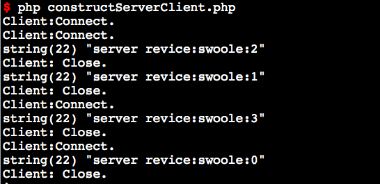
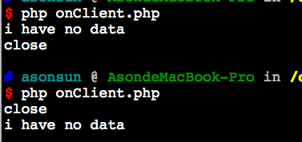
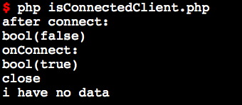
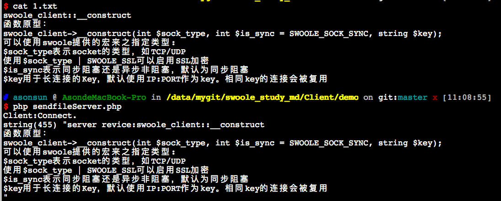

# swoole_client::__construct

函数原型：
```php
swoole_client->__construct(int $sock_type, int $is_sync = SWOOLE_SOCK_SYNC, string $key);
```

可以使用swoole提供的宏来之指定类型:
* $sock_type表示socket的类型，如TCP/UDP
* 使用$sock_type | SWOOLE_SSL可以启用SSL加密
* $is_sync表示同步阻塞还是异步非阻塞，默认为同步阻塞
* $key用于长连接的Key，默认使用IP:PORT作为key。相同key的连接会被复用

在php-fpm/apache中创建长连接
----
```php
$cli = new swoole_client(SWOOLE_TCP | SWOOLE_KEEP);
```

加入SWOOLE_KEEP标志后，创建的TCP连接在PHP请求结束或者调用$cli->close时并不会关闭。下一次执行connect调用时会复用上一次创建的连接。长连接保存的方式默认是以ServerHost:ServerPort为key的。可以再第3个参数内指定key

* SWOOLE_KEEP只允许用于同步客户端

> swoole_client在unset时会自动调用close方法关闭socket

> 异步模式unset时会自动关闭socket并从epoll事件轮询中移除

在swoole_server中使用swoole_client
----

* 必须在事件回调函数中使用swoole_client，不能在swoole_server->start前创建
* swoole_server可以用任何语言编写的 socket client来连接。同样swoole_client也可以去连接任何语言编写的socket server

练手demo（constructServerClient.php）
----


说明：
1. 代码脚本在onWorkerstart时启动客户端，并将客户端访问本身Manager进程启动的Server。相当于worker进程内启动client作为客户端
2. 执行结果可用看出，当Manager接收到客户端发送的信息后则发送结束客户端的信号，并在执行结果上能看出其上下联系是紧靠的

# swoole_client->set

设置客户端参数，必须在connect前执行。swoole为客户端提供了类似swoole_server的自动协议处理功能。通过设置一个参数即可完成TCP的自动
```php
function swoole_client->set(array $settings);
```

[client-配置选项](https://wiki.swoole.com/wiki/page/p-client_setting.html)

# swoole_client->on

注册异步事件回调函数，调用on方法会使当前的socket变成非阻塞的。
```php
int swoole_client::on(string $event, mixed $callback);
```

* 参数1为事件类型，支持connect/error/receive/close 4种。
* 参数2为回调函数，可以是函数名字符串、匿名函数、类静态方法、对象方法。
* 同步阻塞客户端一定不要使用on方法

> 调用swoole_client->close()时会自动退出事件循环

> on方法也可以用在UDP协议上，需要v1.6.3以上版本，UDP协议的connect事件在执行完connect方法后立即被回调 udp没有close事件

v1.6.10
----
从1.6.10开始，onReceive不再需要调用一次$client->recv()来接收数据，onReceive回调函数的第二个参数就是 收到的数据了。
另外onClose事件，也无需调用$client->close()，swoole内核会自动执行close。

```php
$client = new swoole_client(SWOOLE_SOCK_TCP, SWOOLE_SOCK_ASYNC); //异步非阻塞

$client->on("connect", function($cli) {
    $cli->send("hello world\n");
});

$client->on("receive", function($cli, $data = ""){
    $data = $cli->recv(); //1.6.10+ 不需要
    if(empty($data)){
        $cli->close();
        echo "closed\n";
    } else {
        echo "received: $data\n";
        sleep(1);
        $cli->send("hello\n");
    }
});

$client->on("close", function($cli){
    $cli->close(); // 1.6.10+ 不需要
    echo "close\n";
});

$client->on("error", function($cli){
    exit("error\n");
});

$client->connect('127.0.0.1', 9501, 0.5);
```

练手demo（onServer.php、onClient.php）
----


说明：
1. 第一次执行'onClient.php'则将onReceive的'$cli->close()'注释掉，而第二次则没有注释。从执行结果可用看出在client的回调函数中可用执行close，执行后会直接回调到onClose中

# swoole_client->connect

连接到远程服务器，函数原型：
```php
bool $swoole_client->connect(string $host, int $port, float $timeout = 0.5, int $flag = 0)
```

connect方法接受4个参数：
* $host是远程服务器的地址，1.10.0或更高版本已支持自动异步解析域名，$host可直接传入域名
* $port是远程服务器端口
* $timeout是网络IO的超时，包括connect/send/recv，单位是s，支持浮点数。默认为0.5s，即500ms
* $flag参数在UDP类型时表示是否启用udp_connect 设定此选项后将绑定$host与$port，此UDP将会丢弃非指定host/port的数据包。
* $flag参数在TCP类型,$flag=1表示设置为非阻塞socket，connect会立即返回。如果将$flag设置为1，那么在send/recv前必须使用swoole_client_select来检测是否完成了连接

> $timeout超时设置基于底层操作系统SOCKET参数，对异步客户端无效

同步模式
----

connect方法会阻塞，直到连接成功并返回true。这时候就可以向服务器端发送数据或者收取数据了。

```php
if ($cli->connect('127.0.0.1', 9501)) {
      $cli->send("data");
} else {
      echo "connect failed.";
}
```

如果连接失败，会返回false

> 同步TCP客户端在执行close后，可以再次发起Connect创建新连接到服务器

异步模式
----
connect会立即返回true。但实际上连接并未建立。所以不能在connect后使用send。通过isConnected()判断也是false。当连接成功后，系统会自动回调onConnect。这时才可以使用send向服务器发送数据。

> 异步客户端执行connect时会增加一次引用计数，当连接关闭时会减少引用计数

失败重连
----
connect失败后如果希望重连一次，必须先进行close关闭旧的socket，否则会返回EINPROCESS错误，因为当前的socket正在连接服务器，客户端并不知道是否连接成功，所以无法再次执行connect。调用close会关闭当前的socket，底层重新创建新的socket来进行连接。

> 启用SWOOLE_KEEP长连接后，close调用的第一个参数要设置为true表示强行销毁长连接socket

```php
if ($socket->connect('127.0.0.1', 9502) === false) {
    $socket->close(true);
    $socket->connect('127.0.0.1', 9502);
}
```

UDP Connect
----
默认底层并不会启用udp connect，一个UDP客户端执行connect时，底层在创建socket后会立即返回成功。这时此socket绑定的地址是0.0.0.0，任何其他对端均可向此端口发送数据包。

如$client->connect('192.168.1.100', 9502)，这时操作系统为客户端socket随机分配了一个端口58232，其他机器，如192.168.1.101也可以向这个端口发送数据包。

> 未开启udp connect，调用getsockname返回的host项为0.0.0.0

将第4项参数设置为1，启用udp connect，$client->connect('192.168.1.100', 9502, 1, 1)。这时将会绑定客户端和服务器端，底层会根据服务器端的地址来绑定socket绑定的地址。如连接了192.168.1.100，当前socket会被绑定到192.168.1.*的本机地址上。启用udp connect后，客户端将不再接收其他主机向此端口发送的数据包。

# swoole_client->isConnected

返回swoole_client的连接状态
```php
bool swoole_client->isConnected()
```

* 返回false，表示当前未连接到服务器
* 返回true，表示当前已连接到服务器

练手demo（isConnectedClient.php)
----


说明：
1. 执行结果可以看出当执行了connect后，实际上还没有成功建立连接
2. 从执行结果可以看出的确在执行的机制上，on的回调函数都是异步执行，当client与server成功连接后会被调用，以及在onConnect的连接布尔值已为true

注意事项
----
isConnected方法返回的是应用层状态，只表示Client执行了connect并成功连接到了Server，并且没有执行close关闭连接。Client可以执行send、recv、close等操作，但不能再次执行connect。

这不代表连接一定是可用的，当执行send或recv时仍然有可能返回错误，因为应用层无法获得底层TCP连接的状态，执行send或recv时应用层与内核发生交互，才能得到真实的连接可用状态。

# swoole_client->getSocket

调用此方法可以得到底层的socket句柄，返回的对象为sockets资源句柄。

> 此方法需要依赖PHP的sockets扩展，并且编译swoole时需要开启--enable-sockets选项

使用socket_set_option函数可以设置更底层的一些socket参数。

```php
$socket = $client->getSocket();
if (!socket_set_option($socket, SOL_SOCKET, SO_REUSEADDR, 1)) {
    echo 'Unable to set option on socket: '. socket_strerror(socket_last_error()) . PHP_EOL;
}
```

# swoole_client->getPeerName

获取对端socket的IP地址和端口，仅支持SWOOLE_SOCK_UDP/SWOOLE_SOCK_UDP6类型的swoole_client对象。

```php
bool swoole_client->getpeername();
```

UDP协议通信客户端向一台服务器发送数据包后，可能并非由此服务器向客户端发送响应。可以使用getpeername方法获取实际响应的服务器IP:PORT。

> 此函数必须在$client->recv() 之后调用

练手demo（getPeerNameServer.php、getPeerNameClient.php）
----
```php
//执行结果
array(2) {
  ["port"]=>
  int(9501)
  ["host"]=>
  string(9) "127.0.0.1"
}
```

# swoole_client->getPeerCert

获取服务器端证书信息。

```php
function swoole_client->getPeerCert()
```

* 执行成功返回一个X509证书字符串信息
* 执行失败返回false
* 必须在SSL握手完成后才可以调用此方法
* 可以使用openssl扩展提供的openssl_x509_parse函数解析证书的信息

# swoole_client->send

发送数据到远程服务器，必须在建立连接后，才可向Server发送数据。函数原型：

```php
int $swoole_client->send(string $data);
```

* $data参数为字符串，支持二进制数据
* 成功发送返回的已发数据长度
* 失败返回false，并设置$swoole_client->errCode

异步模式下如果SOCKET缓存区已满，Swoole的处理逻辑请参考 [swoole_event_write](https://wiki.swoole.com/wiki/page/372.html)

> 如果未执行connect，调用send会触发PHP警告

同步客户端
----
* 发送的数据没有长度限制
* 发送的数据太大Socket缓存区塞满，底层会阻塞等待可写

异步客户端
----
* 发送数据长度受到socket_buffer_size限制

练手demo（onClient.php、onServer.php）

# swoole_client->sendto

向任意IP:PORT的主机发送UDP数据包，仅支持SWOOLE_SOCK_UDP/SWOOLE_SOCK_UDP6类型的swoole_client对象。
```php
bool swoole_client->sendto(string $ip, int $port, string $data);
```

* $ip，目标主机的IP地址，支持IPv4/IPv6
* $port，目标主机端口
* $data，要发送的数据内容，不得超过64K

练手demo(sendtoServer.php、sendtoClient.php)
----
备注：
1. sendto、send在onConnect方法内执行，都能成功发送到Server中

# swoole_client->sendfile

发送文件到服务器，本函数是基于sendfile操作系统调用实现

```php
bool swoole_client->sendfile(string $filename, int $offset = 0, int $length = 0)
```

> sendfile不能用于UDP客户端和SSL隧道加密连接

参数
----

* $filename指定要发送文件的路径
* $offset 上传文件的偏移量，可以指定从文件的中间部分开始传输数据。此特性可用于支持断点续传。
* $length 发送数据的尺寸，默认为整个文件的尺寸

返回值
----
如果传入的文件不存在，将返回false
执行成功返回true

注意事项
----
* $length, $offset参数在1.9.11或更高版本可用
* 如果是同步client，sendfile会一直阻塞直到整个文件发送完毕或者发生致命错误
* 如果是异步client，sendfile会异步发送，当发生致命错误时会回调onError

练手demo（sendfileServer.php、sendfileClient.php）
----


备注：
1. 从执行结果来看，sendfile的作用是读取文件内的文本内容，将其发送到服务器，而服务器也只是收到文件文本内容，非二进制流数据

# swoole_client->recv

recv方法用于从服务器端接收数据。接受2个参数。函数原型为：

```php
//低于1.7.22
string $swoole_client->recv(int $size = 65535, bool $waitall = 0);
//1.7.22或更高
string $swoole_client->recv(int $size = 65535, int $flags = 0);
```

* $size，接收数据的缓存区最大长度，此参数不要设置过大，否则会占用较大内存
* $waitall，是否等待所有数据到达后返回

> 如果设定了$waitall就必须设定准确的$size，否则会一直等待，直到接收的数据长度达到$size

> 未设置$waitall=true时，$size最大为64K

> 如果设置了错误的$size，会导致recv超时，返回 false

* 成功收到数据返回字符串
* 连接关闭返回空字符串
* 失败返回 false，并设置$client->errCode属性

EOF/Length
----
客户端启用了EOF/Length检测后，无需设置$size和$waitall参数。扩展层会返回完整的数据包或者返回false。

* 当收到错误的包头或包头中长度值超过package_max_length设置时，recv会返回空字符串，PHP代码中应当关闭此连接

Flags
-----
第二个$waitall参数修改为$flags，可以接收一些特殊的SOCKET接收设置。为了兼容旧的接口，如果$flags=1则表示 $flags = swoole_client::MSG_WAITALL

```php
$client->recv(8192, swoole_client::MSG_PEEK | swoole_client::MSG_WAITALL);
```

练手demo（onServer.php、onClient.php）
----

# swoole_client->close

关闭连接，函数原型为：
```php
bool $swoole_client->close(bool $force = false);
```

操作成功返回 true。当一个swoole_client连接被close后不要再次发起connect。正确的做法是销毁当前的swoole_client，重新创建一个swoole_client并发起新的连接。

* 第一个参数设置为true表示强制关闭连接，可用于关闭SWOOLE_KEEP长连接

> swoole_client对象在析构时会自动close

异步客户端
----

客户端close会立即关闭连接，如果发送队列中仍然有待数据，底层会丢弃。请勿在大量发送数据后，立即close，否则发送的数据未必能真正到达服务器端。

#### 错误实例

```php
$client = new swoole_client(SWOOLE_TCP | SWOOLE_ASYNC);
$client->on("connect", function(swoole_client $cli) {

});
$client->on("receive", function(swoole_client $cli, $data){
    $cli->send(str_repeat('A', 1024*1024*4)."\n");
	$cli->close();
});
$client->on("error", function(swoole_client $cli){
    echo "error\n";
});
$client->on("close", function(swoole_client $cli){
    echo "Connection close\n";
});
$client->connect('127.0.0.1', 9501);
```

客户端发送了`4M`数据，实际传输可能需要一段时间。这是立即进行了`close`操作，可能只有小部分数据传输成功。大部分数据在发送队列中排队等待发送，`close`时会丢弃这些数据。

#### 解决方案
* 配合使用`onBufferEmpty`，等待发送队列为空时进行`close`操作
* 协议设计为`onReceive`收到数据后主动关闭连接，发送数据时对端主动关闭连接

```php
$client = new swoole_client(SWOOLE_TCP | SWOOLE_ASYNC);
$client->on("connect", function(swoole_client $cli) {

});
$client->on("receive", function(swoole_client $cli, $data){
    $cli->send(str_repeat('A', 1024*1024*4)."\n");
});
$client->on("error", function(swoole_client $cli){
    echo "error\n";
});
$client->on("close", function(swoole_client $cli){
    echo "Connection close\n";
});
$client->on("bufferEmpty", function(swoole_client $cli){
    $cli->close();
});
$client->connect('127.0.0.1', 9501);
```

# swoole_client->sleep

调用此方法会从事件循环中移除当前socket的可读监听，停止接收数据。

```php
function swoole_client->sleep()
```

* 此方法仅停止从socket中接收数据，但不会移除可写事件，所以不会影响发送队列
* sleep操作与wakeup作用相反，使用wakeup方法可以重新监听可读事件

```php
$client->on("receive", function(swoole_client $cli, $data){
    //睡眠模式，不再接收新的数据
    $cli->sleep();
    swoole_timer_after(5000, function() use ($cli) {
    //唤醒，重新接收数据
    $cli->wakeup();
    });
});
```

# swoole_client->wakeup

调用此方法会重新监听可读事件，将socket连接从睡眠中唤醒。

```php
function swoole_client->wakeup()
```

* 如果socket并未进入sleep模式，wakeup操作没有任何作用

# swoole_client->enableSSL

动态开启SSL隧道加密。客户端在建立连接时使用明文通信，中途希望改为SSL隧道加密通信，可以使用`enableSSL`方法来实现。使用`enableSSL`动态开启SSL隧道加密，需要满足两个条件：

* 客户端创建时类型必须为非SSL
* 客户端已与服务器建立了连接

`enableSSL`方法可同时用于同步和异步客户端，异步客户端需要传入一个回调函数，当SSL握手完成后会回调此函数。同步客户端调用`enableSSL`会阻塞等待SSL握手完成。

同步客户端
----
```php
$client = new swoole_client(SWOOLE_SOCK_TCP);
if (!$client->connect('127.0.0.1', 9501, -1))
{
    exit("connect failed. Error: {$client->errCode}\n");
}
$client->send("hello world\n");
echo $client->recv();
//启用SSL隧道加密
if ($client->enableSSL())
{
	//握手完成，此时发送和接收的数据是加密的
	$client->send("hello world\n");
	echo $client->recv();
}
$client->close();
```

异步客户端
----
```php
$client = new swoole_client(SWOOLE_SOCK_TCP, SWOOLE_SOCK_ASYNC);
$client->on("connect", function(swoole_client $cli) {
    $cli->send("hello world\n");
});
$client->on("receive", function(swoole_client $cli, $data) {
    echo "Receive: $data";
    $cli->send(str_repeat('A', 10)."\n");
	//启用SSL加密
	$cli->enableSSL(function($client) {
		//握手完成，此时发送和接收的数据是加密的
		$client->send("hello");
	})
});
$client->on("error", function(swoole_client $cli){
    echo "error\n";
});
$client->on("close", function(swoole_client $cli){
    echo "Connection close\n";
});
$client->connect('127.0.0.1', 9501);
```

