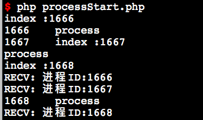

# swoole_process::__construct

创建进程
----
```php
swoole_process::__construct(callable $function, $redirect_stdin_stdout = false, $create_pipe = true);

// 启用命名空间
Swoole\Process::__construct(callable $function, $redirect_stdin_stdout = false, $create_pipe = true)
```


* `$function`，子进程创建成功后要执行的函数，底层会自动将函数保存到对象的`callback`属性上。如果希望更改执行的函数，可赋值新的函数到对象的`callback`属性
* `$redirect_stdin_stdout`，重定向子进程的标准输入和输出。启用此选项后，在子进程内输出内容将不是打印屏幕，而是写入到主进程管道。读取键盘输入将变为从管道中读取数据。默认为阻塞读取。
* `$create_pipe`，是否创建管道，启用`$redirect_stdin_stdout`后，此选项将忽略用户参数，强制为`true`。如果子进程内没有进程间通信，可以设置为 `false`

create_pipe参数
----

自 `1.7.22` 版本起参数`$create_pipe`为int类型且允许设置管道的类型，其默认值为`2`，默认使用`DGRAM`管道。

* 参数 `$create_pipe` 小于等于`0`或为 `false` 时，不创建管道
* 参数 `$create_pipe` 为`1`或为 `true` 时，管道类型将设置为 `SOCK_STREAM`
* 参数`$create_pipe`为`2`时，管道类型将设置为`SOCK_DGRAM`
* 启用`$redirect_stdin_stdout` 后，此选项将忽略用户参数，强制为`1`

> 自 `1.9.6` 版本以后，参数 `$create_pipe` 默认值为 `2`，启用`$redirect_stdin_and_stdout` （即 `redirect_stdin_and_stdout` 为 `true`）后强制为 `1`

> `1.8.3 ~ 1.9.5` 版本，参数 `$create_pipe` 默认值为 `2`，启用 `$redirect_stdin_and_stdout` （即 `redirect_stdin_and_stdout` 为 `true`）后强制为 `2`

> `1.7.22 ~ 1.8.2` 版本，参数`$create_pipe` 默认值为`1`，启用 `$redirect_stdin_and_stdout` （即 `redirect_stdin_and_stdout` 为 `true`）后强制为 `1`

> `swoole_process` ( 或 `Swoole\Process`) 对象在销毁时会自动关闭管道，子进程内如果监听了管道会收到CLOSE事件

> 使用swoole_process作为监控父进程，创建管理子process时，父类必须注册信号SIGCHLD对退出的进程执行wait，否则子process一旦被kill会引起父process exit


在子进程中创建swoole_server
----

例 1：

可以在 `swoole_process` 创建的子进程中使用 `swoole_server`，但为了安全必须在`$process->start` 创建进程后，调用 `$worker->exec()` 执行。代码如下：

```php
<?php
$process = new swoole_process('callback_function', true);

$pid = $process->start();

function callback_function(swoole_process $worker)
{
    $worker->exec('/usr/local/bin/php', array(__DIR__.'/swoole_server.php'));
}

swoole_process::wait();
```

例 2：使用匿名函数作为进程逻辑，并实现了一个简单的父子进程通讯

```php
<?php
$process = new swoole_process(function (swoole_process $process) {
	$process->write('Hello');
}, true);

$process->start();
usleep(100);

echo $process->read(); // 输出 Hello
```

# swoole_process->start

执行fork系统调用，启动进程。
```php
int swoole_process->start();
```


创建成功返回子进程的PID，创建失败返回false。可使用swoole_errno和swoole_strerror得到错误码和错误信息。

* $process->pid 属性为子进程的PID
* $process->pipe 属性为管道的文件描述符

> 执行后子进程会保持父进程的内存和资源，如父进程内创建了一个redis连接，那么在子进程会保留此对象，所有操作都是对同一个连接进行的。

注意事项
----
因为子进程会继承父进程的内存和IO句柄，所以如果父进程要创建多个子进程，务必要等待创建完毕后再使用`swoole_event_add`/`异步swoole_client`/`定时器`/`信号`等异步IO函数。

#### 错误的代码：
```php
$workers = [];
$worker_num = 3;//创建的进程数

for($i=0;$i<$worker_num ; $i++){
    $process = new swoole_process('process');
    $pid = $process->start();
	$workers[$pid] = $process;
	//子进程也会包含此事件
	swoole_event_add($process->pipe, function ($pipe) use($process){
	$data = $process->read();
		echo "RECV: " . $data.PHP_EOL;
	});
}


function process(swoole_process $process){// 第一个处理
	$process->write($process->pid);
    echo $process->pid,"\t",$process->callback .PHP_EOL;
}
```

#### 正确的代码：
```php
$workers = [];
$worker_num = 3;//创建的进程数

for($i=0;$i<$worker_num ; $i++){
    $process = new swoole_process('process');
    $pid = $process->start();
	$workers[$pid] = $process;
}

foreach($workers as $process){
	//子进程也会包含此事件
	swoole_event_add($process->pipe, function ($pipe) use($process){
	$data = $process->read();
		echo "RECV: " . $data.PHP_EOL;
	});
}

function process(swoole_process $process){// 第一个处理
	$process->write($process->pid);
    echo $process->pid,"\t",$process->callback .PHP_EOL;
}
```

练手demo（processStart.php、processStart2.php）
----


1. 从执行结果来看，并不是start后就直接回调到process的function中，而是执行swoole_event_add时才进行执行process的function(processStart.php)


1. 从执行结果来看，由于父进程启动了子进程后就没任何操作（退出）
2. 子进程执行完后就开始sleep

# swoole_process->name

修改进程名称。此函数是swoole_set_process_name的别名。
```php
bool swoole_process::name(string $new_process_name);
$process->name("php server.php: worker");
```

* 在执行exec后，进程名称会被新的程序重新设置

> name方法应当在start之后的子进程回调函数中使用

# swoole_process->exec

执行一个外部程序，此函数是exec系统调用的封装。
```php
bool swoole_process->exec(string $execfile, array $args)
```

* $execfile指定可执行文件的绝对路径，如 "/usr/bin/python"
* $args是一个数组，是exec的参数列表，如 array('test.py', 123)，相当与python test.py 123

执行成功后，当前进程的代码段将会被新程序替换。子进程蜕变成另外一套程序。父进程与当前进程仍然是父子进程关系。

父进程与新进程之间可以通过可以通过标准输入输出进行通信，必须启用标准输入输出重定向。

> $execfile必须使用绝对路径，否则会报文件不存在错误

> 由于exec系统调用会使用指定的程序覆盖当前程序，子进程需要读写标准输出与父进程进行通信

> 如果未指定redirect_stdin_stdout = true，执行exec后子进程与父进程无法通信

调用示例:

```php
$process = new \Swoole\Process(function (\Swoole\Process $childProcess) {
    // 不支持这种写法
    // $childProcess->exec('/usr/local/bin/php /var/www/project/yii-best-practice/cli/yii t/index -m=123 abc xyz');

     // 封装 exec 系统调用
     // 绝对路径
     // 参数必须分开放到数组中
    $childProcess->exec('/usr/local/bin/php', ['/var/www/project/yii-best-practice/cli/yii', 't/index', '-m=123', 'abc', 'xyz']); // exec 系统调用
});
$process->start(); // 启动子进程
```

练手demo
------
processExec.php

# swoole_process->write

向管道内写入数据。

```php
int swoole_process->write(string $data);
```

* $data的长度在Linux系统下最大不超过8K，MacOS/FreeBSD下最大不超过2K
* 在子进程内调用write，父进程可以调用read接收此数据
* 在父进程内调用write，子进程可以调用read接收此数据

Swoole底层使用Unix Socket实现通信，Unix Socket是内核实现的全内存通信，无任何IO消耗。在1进程write，1进程read，每次读写1024字节数据的测试中，100万次通信仅需1.02秒。

管道通信默认的方式是流式，write写入的数据在read可能会被底层合并。可以设置swoole_process构造函数的第三个参数为2改变为数据报式。

异步模式
----
如果进程内使用了异步IO，比如swoole_event_add，进程内执行write操作将变为异步模式。swoole底层会监听可写事件，自动完成管道写入。

异步模式下如果SOCKET缓存区已满，Swoole的处理逻辑请参考 swoole_event_write

同步模式
----
进程内未使用任何异步IO，当前管道为同步阻塞模式，如果缓存区已满，将阻塞等待直到write操作完成。

* Task进程就是同步阻塞的模式，如果管道的缓存区已满，调用write时会发生阻塞

乱序丢包
----
很多网络文章提到DGRAM模式下会出现丢包、乱序问题，实际上这些问题仅存在于Internet网络的UDP通信。UnixSocket是Linux内核实现的内存数据队列，不会出现丢包乱序问题。write写入和read读取的顺序是完全一致的。write返回成功后一定是可以read到的。

练手demo
------
processWriteRead.php


# swoole_process->read

从管道中读取数据

```php
function swoole_process->read(int $buffer_size=8192) : string | bool;
```

* $buffer_size是缓冲区的大小，默认为8192，最大不超过64K
* 管道类型为DGRAM数据报时，read可以读取完整的一个数据包
* 管道类型为STREAM时，read是流式的，需要自行处理包完整性问题
* 读取成功返回二进制数据字符串，读取失败返回false

> 这里是同步阻塞读取的，可以使用swoole_event_add将管道加入到事件循环中，变为异步模式

练手demo
------
processWriteRead.php


# swoole_process->setTimeout

设置管道读写操作的超时时间。
```php
function swoole_process->setTimeout(double $timeout)
```

* $timeout单位为秒，支持浮点型，如1.5表示1s+500ms
* 设置成功返回true
* 设置失败返回false，可使用swoole_errno获取错误码

设置成功后，调用recv和write在规定时间内未读取或写入成功，将返回false，可使用swoole_errno获取错误码。

使用实例
----
```php
$process = new \swoole_process(function(\swoole_process $process) {
    sleep(5);
});
$process->start();

$process->setTimeout(0.5);
$ret = $process->read();
```

# swoole_process->useQueue

启用消息队列作为进程间通信

```php
bool swoole_process->useQueue(int $msgkey = 0, int $mode = 2);
```
useQueue方法接受2个可选参数


* $msgkey是消息队列的key，默认会使用ftok(__FILE__, 1)作为KEY
* $mode通信模式，默认为2，表示争抢模式，所有创建的子进程都会从队列中取数据
* 如果创建消息队列失败，会返回false。可使用swoole_strerror(swoole_errno()) 得到错误码和错误信息。

> 使用模式2后，创建的子进程无法进行单独通信，比如发给特定子进程。

> $process对象并未执行start，也可以执行push/pop向队列推送/提取数据

> 消息队列通信方式与管道不可共用。消息队列不支持EventLoop，使用消息队列后只能使用同步阻塞模式

非阻塞
----
增加了swoole_process::IPC_NOWAIT的支持，可将队列设置为非阻塞。在非阻塞模式下，队列已满调用push方法、队列已空调用pop方法时将不再阻塞立即返回。

```php
//设置为非阻塞模式
$process->useQueue($key, $mode | swoole_process::IPC_NOWAIT);
```

# swoole_process->freeQueue

删除队列。此方法与`useQueue`成对使用，`useQueue`创建队列，使用`freeQueue`销毁队列。销毁队列后队列中的数据会被清空。

如果程序中只调用了`useQueue`方法，未调用`freeQueue`在程序结束时并不会清除数据。重新运行程序时可以继续读取上次运行时留下的数据。

系统重启时消息队列中的数据会被丢弃。

```php
function swoole_process->freeQueue();
```

# swoole_process->statQueue
查看消息队列状态。

```php
array swoole_process->statQueue();
```

* 返回一个数组，包括2项信息
* queue_num 队列中的任务数量
* queue_bytes 队列数据的总字节数

```php
array(
  "queue_num" => 10,
  "queue_bytes" => 161,
);
```

# swoole_process->push

投递数据到消息队列中。
```php
bool swoole_process->push(string $data);
```


* $data要投递的数据，长度受限与操作系统内核参数的限制。默认为8192，最大不超过65536
* 操作失败会返回false，成功返回true
* 默认模式下（阻塞模式），如果队列已满，push方法会阻塞等待
* 非阻塞模式下，如果队列已满，push方法会立即返回false

```php
$workers = [];
$worker_num = 2;

for($i = 0; $i < $worker_num; $i++)
{
    $process = new swoole_process('callback_function', false, false);
    $process->useQueue();
    $pid = $process->start();
    $workers[$pid] = $process;
    //echo "Master: new worker, PID=".$pid."\n";
}

function callback_function(swoole_process $worker)
{
    //echo "Worker: start. PID=".$worker->pid."\n";
    //recv data from master
    $recv = $worker->pop();

    echo "From Master: $recv\n";

    sleep(2);
    $worker->exit(0);
}

foreach($workers as $pid => $process)
{
    $process->push("hello worker[$pid]\n");
}

for($i = 0; $i < $worker_num; $i++)
{
    $ret = swoole_process::wait();
    $pid = $ret['pid'];
    unset($workers[$pid]);
    echo "Worker Exit, PID=".$pid.PHP_EOL;
}
```

练手demo
------
processPush.php


# swoole_process->pop

从队列中提取数据。

```php
string swoole_process->pop(int $maxsize = 8192);
```

* $maxsize表示获取数据的最大尺寸，默认为8192
* 操作成功会返回提取到的数据内容，失败返回false
* 默认模式下，如果队列中没有数据，pop方法会阻塞等待
* 非阻塞模式下，如果队列中没有数据，pop方法会立即返回false，并设置错误码为ENOMSG

# swoole_process->close

用于关闭创建的好的管道。
```php
bool swoole_process->close(int $which = 0);
```

* $which 指定关闭哪一个管道，默认为0表示同时关闭读和写，1：关闭写，2关闭读

有一些特殊的情况swoole_process对象无法释放，如果持续创建进程会导致连接泄漏。调用此函数就可以直接关闭管道，释放资源。

# swoole_process->exit

退出子进程
```php
int swoole_process->exit(int $status=0);
```
$status是退出进程的状态码，如果为0表示正常结束，会继续执行PHP的shutdown_function，其他扩展的清理工作。

如果$status不为0，表示异常退出，会立即终止进程。不再执行PHP的shutdown_function，其他扩展的清理工作。

在父进程中，执行swoole_process::wait可以得到子进程退出的事件和状态码。

# swoole_process::daemon
使当前进程蜕变为一个守护进程。
```php
//低于1.9.1的版本
bool swoole_process::daemon(bool $nochdir = false, bool $noclose = false);
//1.9.1或更高版本
bool swoole_process::daemon(bool $nochdir = true, bool $noclose = true);
```
* $nochdir，为true表示不要切换当前目录到根目录。
* $noclose，为true表示不要关闭标准输入输出文件描述符。

> 此函数在1.7.5-stable版本后可用
> 1.9.1或更高版本修改了默认值，现在默认nochir和noclose均为true
> 蜕变为守护进程时，该进程的PID将重新fork，可以使用getmypid()来获取当前的PID

# swoole_process::signal

设置异步信号监听。
```php
bool swoole_process::signal(int $signo, callable $callback);
```
* 此方法基于`signalfd`和`eventloop`是异步IO，不能用于同步程序中
* 同步阻塞的程序可以使用pcntl扩展提供的`pcntl_signal`
* `$callback`如果为`null`，表示移除信号监听
* 如果已设置了此信号的回调函数，重新设置时会覆盖历史设置

使用举例：
```php
swoole_process::signal(SIGTERM, function($signo) {
     echo "shutdown.";
});
```

> swoole_server中不能设置SIGTERM和SIGALAM信号
> swoole_process::signal在swoole-1.7.9以上版本可用
> 信号移除特性仅在1.7.21或更高版本可用

# swoole_process::alarm

高精度定时器，是操作系统`setitimer`系统调用的封装，可以设置微秒级别的定时器。定时器会触发信号，需要与`swoole_process::signal`或`pcntl_signal`配合使用。

```php
function swoole_process::alarm(int $interval_usec, int $type = ITIMER_REAL) : bool
```

* $interval_usec 定时器间隔时间，单位为微秒。如果为负数表示清除定时器
* $type 定时器类型，0 表示为真实时间,触发`SIGALAM`信号，1 表示用户态CPU时间，触发`SIGVTALAM`信号，2 表示用户态+内核态时间，触发`SIGPROF`信号
* 设置成功返回true，失败返回false，可以使用`swoole_errno`得到错误码

> alarm不能和`Swoole\Timer`同时使用
> alarm在1.8.13或更高版本可用

使用实例
----

```php
swoole_process::signal(SIGALRM, function () {
    static $i = 0;
    echo "#{$i}\talarm\n";
    $i++;
    if ($i > 20) {
        swoole_process::alarm(-1);
    }
});

//100ms
swoole_process::alarm(100 * 1000);
```

# swoole_process::setaffinity
设置CPU亲和性，可以将进程绑定到特定的CPU核上。
```php
function swoole_process::setaffinity(array $cpu_set);
```

* 接受一个数组参数表示绑定哪些CPU核，如array(0,2,3)表示绑定CPU0/CPU2/CPU3
* 成功返回true，失败返回false

> $cpu_set内的元素不能超过CPU核数
> CPU-ID不得超过（CPU核数 - 1）
> 使用 `swoole_cpu_num()` 可以得到当前服务器的CPU核数
> setaffinity函数在1.7.18以上版本可用

此函数的作用是让进程只在某几个CPU核上运行，让出某些CPU资源执行更重要的程序。

