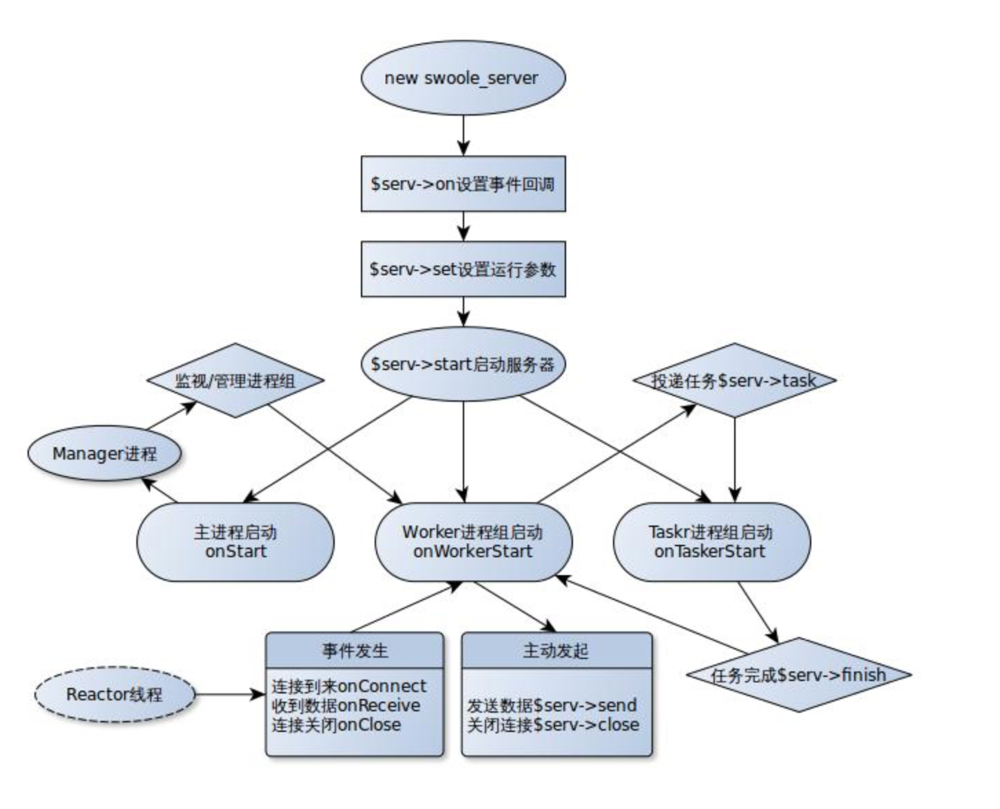
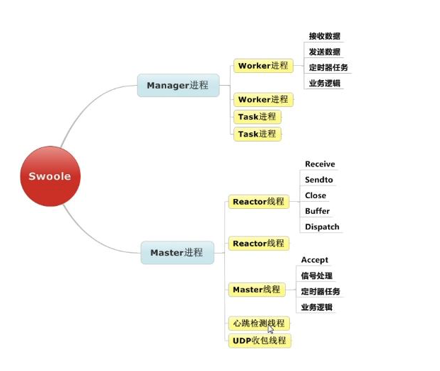

## Server的生命周期



### 生命周期的开始--构建Server对象

````
$serv = new swoole_server('0.0.0.0', 9501, SWOOLE_BASE, SWOOLE_SOCK_TCP);
````

### 设置回调函数
````
$serv->on('Connect', 'my_onConnect'); //连接成功时回调的事件
$serv->on('Receive', 'my_onReceive'); //接收到信息时回调的事件
$serv->on('Close', 'my_onClose'); //Server结束时回调的事件
````

### 设置运行参数
````
$serv->set(array(
    'worker_num' => 4, //进程数量
    'daemonize' => true, //是否守护进程模式
    'backlog' => 128,
));
````

### 启动服务器
````
$serv->start();
````

### 属性列表
````
$serv->manager_pid;  //管理进程的PID，通过向管理进程发送SIGUSR1信号可实现柔性重启
$serv->master_pid;  //主进程的PID，通过向主进程发送SIGTERM信号可安全关闭服务器
$serv->connections; //当前服务器的客户端连接，可使用foreach遍历所有连接
````

