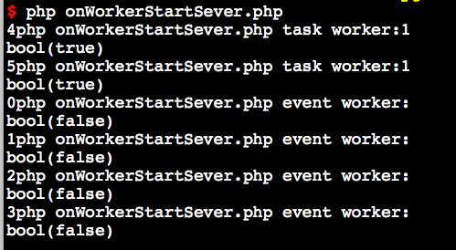

# 事件回调函数

`Swoole\Server`是事件驱动模式，所有的业务逻辑代码必须写在事件回调函数中。当特定的网络事件发生后，底层会主动回调指定的PHP函数。

事件执行顺序
----

* 所有事件回调均在`$server->start`后发生
* 服务器关闭程序终止时最后一次事件是`onShutdown`
* 服务器启动成功后，`onStart`/`onManagerStart`/`onWorkerStart`会在不同的进程内并发执行
* `onReceive`/`onConnect`/`onClose`在`Worker`进程中触发
* `Worker`/`Task`进程启动/结束时会分别调用一次`onWorkerStart`/`onWorkerStop`
* `onTask`事件仅在`task`进程中发生
* `onFinish`事件仅在`worker`进程中发生

> onStart/onManagerStart/onWorkerStart 3个事件的执行顺序是不确定的

异常捕获
----

* swoole不支持set_exception_handler函数
* 如果你的PHP代码有抛出异常逻辑，必须在事件回调函数顶层进行try/catch来捕获异常

```php
$serv->on('Receive', function() {
    try
    {
        //some code
    }
    catch(Exception $e)
    {
        //exception code
    }
}
```

# onStart

`Server`启动在主进程的主线程回调此函数，函数原型

```php
function onStart(swoole_server $server);
```

在此事件之前Swoole Server已进行了如下操作

* 已创建了manager进程
* 已创建了worker子进程
* 已监听所有TCP/UDP端口
* 已监听了定时器

接下来要执行

* 主Reactor开始接收事件，客户端可以connect到Server

__onStart回调中，仅允许echo、打印Log、修改进程名称。不得执行其他操作。onWorkerStart和onStart回调是在不同进程中并行执行的，不存在先后顺序__

可以在onStart回调中，将$serv->master_pid和$serv->manager_pid的值保存到一个文件中。这样可以编写脚本，向这两个PID发送信号来实现关闭和重启的操作

onStart事件在Master进程的主线程中被调用

> 在onStart中创建的**全局资源对象**不能在worker进程中被使用，因为发生onStart调用时，worker进程已经创建好了。

> 新创建的对象在主进程内，worker进程无法访问到此内存区域。

> 因此全局对象创建的代码需要放置在swoole_server_start之前。


# onShutdown

此事件在`Server`正常结束时发生，函数原型
```php
function onShutdown(swoole_server $server);
```

在此之前`Swoole\Server`已进行了如下操作

* 已关闭所有Reactor线程、HeartbeatCheck线程、UdpRecv线程
* 已关闭所有Worker进程、Task进程、User进程
* 已close所有TCP/UDP/UnixSocket监听端口
* 已关闭主Reactor

> 强制kill进程不会回调onShutdown，如kill -9

> 需要使用kill -15来发送SIGTREM信号到主进程才能按照正常的流程终止

> 在命令行中使用Ctrl+C中断程序会立即停止，底层不会回调onShutdown

# onWorkerStart

此事件在`Worker`进程/`Task`进程启动时发生。这里创建的对象可以在进程生命周期内使用。原型：

```php
function onWorkerStart(swoole_server $server, int $worker_id);
```

* 发生致命错误或者代码中主动调用`exit`时，`Worker`/`Task`进程会退出，管理进程会重新创建新的进程
* `onWorkerStart`/`onStart`是并发执行的，没有先后顺序
* 可以通过`$server->taskworker`属性来判断当前是`Worker`进程还是`Task`进程

下面的示例用于为`Worker`进程/`Task`进程重命名:
```php
$serv->on('WorkerStart', function ($serv, $worker_id){
    global $argv;
    if($worker_id >= $serv->setting['worker_num']) {
        swoole_set_process_name("php {$argv[0]} task worker");
    } else {
        swoole_set_process_name("php {$argv[0]} event worker");
    }
});
```

如果想使用`Reload`机制实现代码重载入，必须在`onWorkerStart`中`require`你的业务文件，而不是在文件头部。在`onWorkerStart`调用之前已包含的文件，不会重新载入代码。

> 可以将公用的、不易变的php文件放置到onWorkerStart之前。这样虽然不能重载入代码，但所有Worker是共享的，不需要额外的内存来保存这些数据。

> onWorkerStart之后的代码每个进程都需要在内存中保存一份

* $worker_id是一个从0-$worker_num之间的数字，表示这个Worker进程的ID
* $worker_id和进程PID没有任何关系，可使用posix_getpid函数获取PID

练手demo
------
demo文件:onWorderStartServer.php

执行结果:


```记录
1. 在终端执行结果可用看出task进程启动要优于worker进行，但从启动ID来看缺是tasker的ID大于workerID。因此可认为tasker跟worker启动是并行的
2. 从ID的角度来看，是先分配完workerID后再分配taskerID
```

# onWorkerStop

此事件在worker进程终止时发生。在此函数中可以回收worker进程申请的各类资源。原型：
```php
function onWorkerStop(swoole_server $server, int $worker_id);
```

* $worker_id是一个从0-$worker_num之间的数字，表示这个worker进程的ID
* $worker_id和进程PID没有任何关系
* 进程异常结束，如被强制kill、致命错误、core dump 时无法执行onWorkerStop回调函数

# onWorkerExit

仅在开启`reload_async`特性后有效。异步重启特性，会先创建新的Worker进程处理新请求，旧的Worker进程自行退出。原型:
```php
function onWorkerExit(swoole_server $server, int $worker_id);
```

* `Worker`进程未退出，`onWorkerExit`会持续触发
* `onWorkerExit`仅在Worker进程内触发，`Task`进程不执行`onWorkerExit`

旧的`Worker`进程，在退出时先会执行一次`onWorkerStop`事件回调，然后会在事件循环的每个周期结束时调用`onWorkerExit`通知`Worker`进程退出。

在`onWorkerExit`中尽可能地移除/关闭异步的Socket连接，最终底层检测到`Reactor`中事件监听的句柄数量为0时退出进程

# onConnect

有新的连接进入时，在worker进程中回调。函数原型：

```php
function onConnect(swoole_server $server, int $fd, int $reactorId);
```

* $server是Swoole\Server对象
* $fd是连接的文件描述符，发送数据/关闭连接时需要此参数
* $reactorId来自哪个Reactor线程

> 关于$fd和$reactorId [详细解释](https://wiki.swoole.com/wiki/page/56.html)

> onConnect/onClose这2个回调发生在worker进程内，而不是主进程

> UDP协议下只有onReceive事件，没有onConnect/onClose事件

dispatch_mode = 1/3
----
当设置dispatch_mode = 1/3时会自动去掉onConnect/onClose事件回调。原因是：

* 在此模式下onConnect/onReceive/onClose可能会被投递到不同的进程。连接相关的PHP对象数据，无法实现在onConnect回调初始化数据，onClose清理数据
* onConnect/onReceive/onClose 3种事件可能会并发执行，可能会带来异常

# onReceive

接收到数据时回调此函数，发生在worker进程中。函数原型：
```php
function onReceive(swoole_server $server, int $fd, int $reactor_id, string $data);
```

* $server，swoole_server对象
* $fd，TCP客户端连接的唯一标识符
* $reactor_id，TCP连接所在的Reactor线程ID
* $data，收到的数据内容，可能是文本或者二进制内容

> 未开启swoole的自动协议选项，onReceive回调函数单次收到的数据最大为64K
> Swoole支持二进制格式，$data可能是二进制数据

协议说明
----

* UDP协议，`onReceive`可以保证总是收到一个完整的包，最大长度不超过64K
* UDP协议下，$fd参数是对应客户端的IP，`$reactor_id`是客户端的端口和来源端口； 客户端ip等于long2ip(unpack('N',pack('L',$fd))[1])；
* TCP协议是流式的，`onReceive`无法保证数据包的完整性，可能会同时收到多个请求包，也可能只收到一个请求包的一部分数据
* swoole只负责底层通信，$data是通过网络接收到的原始数据。对数据解包打包需要在PHP代码中自行实现

> 如果开启了eof_check/length_check/http_protocol，$data的长度可能会超过64K，但最大不超过$server->setting['package_max_length']

关于TCP协议下包完整性
----

* 使用swoole提供的open_eof_check/open_length_check/open_http_protocol，可以保证数据包的完整性
* 不使用swoole的协议处理，在onReceive后PHP代码中自行对数据分析，合并/拆分数据包。

例如：代码中可以增加一个 $buffer = array()，使用$fd作为key，来保存上下文数据。 每次收到数据进行字符串拼接，$buffer[$fd] .= $data，然后在判断$buffer[$fd]字符串是否为一个完整的数据包。

例如：代码中可以增加一个 $buffer = array()，使用$fd作为key，来保存上下文数据。 每次收到数据进行字符串拼接，$buffer[$fd] .= $data，然后在判断$buffer[$fd]字符串是否为一个完整的数据包。

默认情况下，同一个fd会被分配到同一个worker中，所以数据可以拼接起来。__使用dispatch_mode = 3时__。
__请求数据是抢占式的，同一个fd发来的数据可能会被分到不同的进程。所以无法使用上述的数据包拼接方法__

关于粘包问题，如SMTP协议，客户端可能会同时发出2条指令。在swoole中可能是一次性收到的，这时应用层需要自行拆包。smtp是通过\r\n来分包的，所以业务代码中需要 explode("\r\n", $data)来拆分数据包

如果是请求应答式的服务，无需考虑粘包问题。原因是客户端在发起一次请求后，必须等到服务器端返回当前请求的响应数据，才会发起第二次请求，不会同时发送2个请求

多端口监听
-----
当主服务器设置了协议后，额外监听的端口默认会继承主服务器的设置。需要显式调用set方法来重新设置端口的协议

```php
$serv = new swoole_http_server("127.0.0.1", 9501);
$port2 = $serv->listen('127.0.0.1', 9502, SWOOLE_SOCK_TCP);
$port2->on('receive', function (swoole_server $serv, $fd, $reactor_id, $data) {
    echo "[#".$serv->worker_id."]\tClient[$fd]: $data\n";
});
```

这里虽然调用了`on`方法注册了`onReceive`回调函数，但由于没有调用`set`方法覆盖主服务器的协议，新监听的9502端口依然使用`Http`协议。使用`telnet`客户端连接`9502`端口发送字符串时服务器不会触发`onReceive`

# onPacket

接收到UDP数据包时回调此函数，发生在worker进程中。函数原型：
```php
function onPacket(swoole_server $server, string $data, array $client_info);
```

* $server，swoole_server对象
* $data，收到的数据内容，可能是文本或者二进制内容
* $client_info，客户端信息包括address/port/server_socket 3项数据

服务器同时监听TCP/UDP端口时，收到TCP协议的数据会回调`onReceive`，收到UDP数据包回调`onPacket`，服务器设置的EOF或Length协议对UDP端口是不生效的，因为UDP包本身存在消息边界，不需要额外的协议处理

> 如果未设置`onPacket`回调函数，收到UDP数据包默认会回调`onReceive`函数

数据转换
----
`onPacket`回调可以通过计算得到`onReceive`的$fd和$reactor_id参数值。计算方法如下：

```php
$fd = unpack('L', pack('N', ip2long($addr['address'])))[1];
$reactor_id = ($addr['server_socket'] << 16) + $addr['port'];
```

# onClose

TCP客户端连接关闭后，在worker进程中回调此函数。函数原型：

```php
function onClose(swoole_server $server, int $fd, int $reactorId);
```

* $server 是swoole_server对象
* $fd 是连接的文件描述符
* $reactorId 来自那个reactor线程

> onClose回调函数如果发生了致命错误，会导致连接泄漏。通过netstat命令会看到大量CLOSE_WAIT状态的TCP连接

> 无论由客户端发起close还是服务器端主动调用$serv->close()关闭连接，都会触发此事件。因此只要连接关闭，就一定会回调此函数

注意：这里回调onClose时表示客户端连接已经关闭，所以无需执行$server->close($fd)。代码中执行$serv->close($fd)会抛出PHP错误告警

主动关闭
----
swoole-1.9.7版本修改了$reactorId参数，当服务器主动关闭连接时，底层会设置此参数为-1，可以通过判断$reactorId < 0来分辨关闭是由服务器端还是客户端发起的。

# onBufferFull

当缓存区达到最高水位时触发此事件。

```php
function onBufferFull(Swoole\Server $serv, int $fd);
```

* 设置server->buffer_high_watermark选项来控制缓存区高水位线
* 触发onBufferFull表明此连接$fd的发送队列已触顶即将塞满，这时不应当再向此$fd发送数据

# onBufferEmpty

当缓存区低于最低水位线时触发此事件。

```php
function onBufferEmpty(Swoole\Server $serv, int $fd);
```

* 设置server->buffer_low_watermark来控制缓存区低水位线
* 触发此事件后，表明当前的$fd发送队列中的数据已被发出，可以继续向此连接发送数据了

# onTask

在task_worker进程内被调用。worker进程可以使用swoole_server_task函数向task_worker进程投递新的任务。当前的Task进程在调用`onTask`回调函数时会将进程状态切换为忙碌，这时将不再接收新的Task，当`onTask`函数返回时会将进程状态切换为空闲然后继续接收新的Task。

```php
function onTask(swoole_server $serv, int $task_id, int $src_worker_id, mixed $data);
```

* $task_id是任务ID，由swoole扩展内自动生成，用于区分不同的任务。$task_id和$src_worker_id组合起来才是全局唯一的，不同的worker进程投递的任务ID可能会有相同
* $src_worker_id来自于哪个worker进程
* $data 是任务的内容

> onTask函数执行时遇到致命错误退出，或者被外部进程强制kill，当前的任务会被丢弃，但不会影响其他正在排队的Task

返回执行结果到worker进程
----

在onTask函数中 return字符串，表示将此内容返回给worker进程。worker进程中会触发onFinish函数，表示投递的task已完成。

> return的变量可以是任意非null的PHP变量

# onFinish

当worker进程投递的任务在task_worker中完成时，task进程会通过swoole_server->finish()方法将任务处理的结果发送给worker进程。

```php
void onFinish(swoole_server $serv, int $task_id, string $data)
```

* $task_id是任务的ID
* $data是任务处理的结果内容

> task进程的onTask事件中没有调用finish方法或者return结果，worker进程不会触发onFinish

> 执行onFinish逻辑的worker进程与下发task任务的worker进程是同一个进程

# onPipeMessage

当工作进程收到由 sendMessage 发送的管道消息时会触发`onPipeMessage`事件。worker/task进程都可能会触发`onPipeMessage`事件。函数原型：

```php
void onPipeMessage(swoole_server $server, int $src_worker_id, mixed $message);
```

* $src_worker_id消息来自哪个Worker进程
* $message消息内容，可以是任意PHP类型

# onWorkerError

当worker/task_worker进程发生异常后会在Manager进程内回调此函数。

```php
void onWorkerError(swoole_server $serv, int $worker_id, int $worker_pid, int $exit_code, int $signal);
```

* $worker_id 是异常进程的编号
* $worker_pid 是异常进程的ID
* $exit_code 退出的状态码，范围是 1 ～255
* $signal 进程退出的信号

此函数主要用于报警和监控，一旦发现Worker进程异常退出，那么很有可能是遇到了致命错误或者进程CoreDump。通过记录日志或者发送报警的信息来提示开发者进行相应的处理。


# onManagerStart

当管理进程启动时调用它，函数原型：

```php
void onManagerStart(swoole_server $serv);
```

在这个回调函数中可以修改管理进程的名称。

> 注意manager进程中不能添加定时器

> manager进程中可以调用sendMessage接口向其他工作进程发送消息

# onManagerStop

当管理进程结束时调用它，函数原型：

```php
void onManagerStop(swoole_server $serv);
```