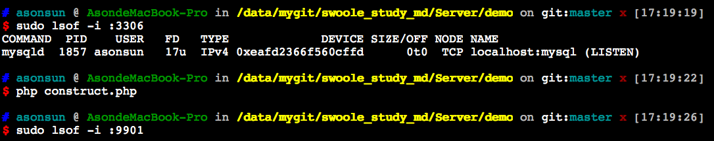
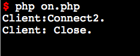
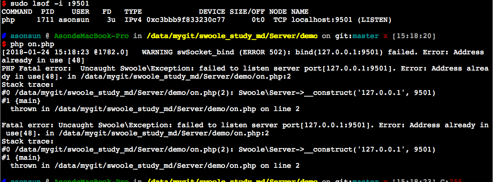
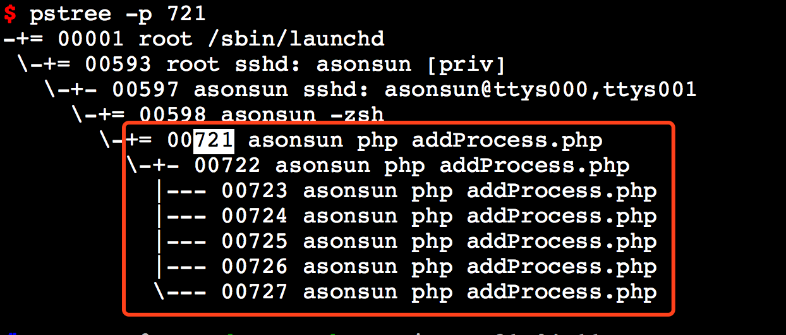
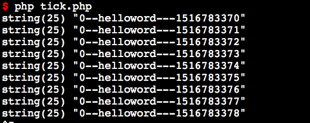
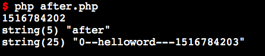

# swoole_server::__construct

创建一个异步Server对象

````
$serv = new swoole_server(string $host, int $port = 0, int $mode = SWOOLE_PROCESS,
    int $sock_type = SWOOLE_SOCK_TCP);
````

## 参数
* $host参数用来指定监听的ip地址，如127.0.0.1，或者外网地址，或者0.0.0.0监听全部地址  
    *  IPv4使用 127.0.0.1表示监听本机，0.0.0.0表示监听所有地址  
    * IPv6使用::1表示监听本机，:: (相当于0:0:0:0:0:0:0:0) 表示监听所有地址

* $port监听的端口，如9501  
    * 如果$sock_type为UnixSocket Stream/Dgram，此参数将被忽略
    * 监听小于1024端口需要root权限
    * 如果此端口被占用server->start时会失败

* $mode运行的模式
    * SWOOLE_PROCESS多进程模式（默认）
    * SWOOLE_BASE基本模式

* $sock_type指定Socket的类型，支持TCP、UDP、TCP6、UDP6、UnixSocket Stream/Dgram 6种

## 注意事项

* 底层有保护机制，一个PHP程序内只能创建启动一个Server实例
* 如果要实现多个Server实例的管理，父进程必须使用exec，不得使用fork

## demo练手（construct.php）



````
php脚本只是单纯将swoole实例化出来，并没有启动的情况下可以根据执行结果看出并没有占用对应实例化出来的端口，因此可以认为即使实例化出来没有开启一样不会有效果
````

# swoole_server->set

swoole_server->set函数用于设置swoole_server运行时的各项参数。服务器启动后通过$serv->setting来访问set函数设置的参数数组。  


````
//原型：
function swoole_server->set(array $setting);

//示例：
$serv->set(array(
    //通过此参数来调节poll线程的数量，以充分利用多核
    'reactor_num' => 2, 
    
    //设置启动的worker进程数量。swoole采用固定worker进程的模式
    //PHP代码中是全异步非阻塞，worker_num配置为CPU核数的1-4倍即可。如果是同步阻塞，worker_num配置为100或者更高，具体要看每次请求处理的耗时和操作系统负载状况。
    'worker_num' => 4, 
    
    //此参数将决定最多同时有多少个待accept的连接，swoole本身accept效率是很高的，基本上不会出现大量排队情况。
    'backlog' => 128,  
    
    //此参数表示worker进程在处理完n次请求后结束运行。manager会重新创建一个worker进程。此选项用来防止worker进程内存溢出
    //设置为0表示不自动重启。在Worker进程中需要保存连接信息的服务，需要设置为0.
    'max_request' => 50,
    
    //worker进程数据包分配模式:1平均分配，2按FD取模固定分配，3抢占式分配，默认为取模(dispatch=2)
    //抢占式分配，每次都是空闲的worker进程获得数据。很合适SOA/RPC类的内部服务框架
    //当选择为dispatch=3抢占模式时，worker进程内发生onConnect/onReceive/onClose/onTimer会将worker进程标记为忙，不再接受新的请求。reactor会将新请求投递给其他状态为闲的worker进程
      如果希望每个连接的数据分配给固定的worker进程，dispatch_mode需要设置为2
    'dispatch_mode' => 1,
    
    //此参数用来设置Server最大允许维持多少个tcp连接。超过此数量后，新进入的连接将被拒绝
    'max_con' => 1000, 
    
    //加入此参数后，执行php server.php将转入后台作为守护进程运行
    daemonize => 1, 
    
    //启用CPU亲和设置
    open_cpu_affinity => 1,
    
    //TCP_NoDelay启用
    open_tcp_nodelay => 1 ,
    
    //此参数设定一个秒数，当客户端连接连接到服务器时，在约定秒数内并不会触发accept，直到有数据发送，或者超时时才会触发。
    tcp_defer_accept => 5,
    
    //指定swoole错误日志文件。在swoole运行期发生的异常信息会记录到这个文件中。默认会打印到屏幕
    log_file => '/data/log/swoole.log',
    
    //buffer主要是用于检测数据是否完整，如果不完整swoole会继续等待新的数据到来。直到收到完整的一个请求，才会一次性发送给worker进程。这时onReceive会收到一个超过SW_BUFFER_SIZE，
    //小于$serv->setting['package_max_length']的数据。
    //目前仅提供了EOF检测、固定包头长度检测2种buffer模式。
    open_eof_check => true, //打开buffer
    package_eof => "\r\n\r\n", //设置EOF
    
    //每隔多少秒检测一次，单位秒，Swoole会轮询所有TCP连接，将超过心跳时间的连接关闭掉
    heartbeat_check_interval => 30,
    //TCP连接的最大闲置时间，单位s , 如果某fd最后一次发包距离现在的时间超过heartbeat_idle_time会把这个连接关闭。
    heartbeat_idle_time => 60,
    
    
));
````

**swoole_server->set只能在swoole_server->start前调用**


# swoole_server->on

注册Server的事件回调函数。

````
bool swoole_server->on(string $event, mixed $callback);
````

* 第1个参数是回调的名称, 大小写不敏感，具体内容参考回调函数列表，事件名称字符串不要加on
* 第2个函数是回调的PHP函数，可以是函数名的字符串，类静态方法，对象方法数组，匿名函数。

**重复调用on方法时会覆盖上一次的设定**

## demo练手（on.php）




````
1.根据第一张图可以看到当进程启动后通过浏览器访问则触发连接（connect）与断开（close）的回调
2.因为demo代码中写了两个connect的方法，印证了'重复调用on方法时会覆盖上一次的设定'
3.图2证明了进程启动后9501端口的确被占用了
````

# swoole_server->addListener

Swoole提供了swoole_server::addListener来增加监听的端口。业务代码中可以通过调用swoole_server::connection_info来获取某个连接来自于哪个端口

````
//函数原型：
function swoole_server->addListener(string $host, int $port, $type = SWOOLE_SOCK_TCP);
````
* 监听1024以下的端口需要root权限
* 1.8.0版本增加了多端口监听的功能，监听成功后会返回Swoole\Server\Port对象
* 在此对象上可以设置另外的事件回调函数和运行参数
* 监听失败返回false，可调用getLastError方法获取错误码
* 主服务器是WebSocket或Http协议，新监听的TCP端口默认会继承主Server的协议设置。必须单独调用set方法设置新的协议才会启用新协议 查看详细说明

## swoole支持的Socket类型


* SWOOLE_TCP/SWOOLE_SOCK_TCP //tcp ipv4 socket
* SWOOLE_TCP6/SWOOLE_SOCK_TCP6 //tcp ipv6 socket
* SWOOLE_UDP/SWOOLE_SOCK_UDP //udp ipv4 socket
* SWOOLE_UDP6/SWOOLE_SOCK_UDP6 //udp ipv6 socket
* SWOOLE_UNIX_DGRAM //unix socket dgram
* SWOOLE_UNIX_STREAM //unix socket stream

# swoole_server->addProcess

添加一个用户自定义的工作进程。此函数通常用于创建一个特殊的工作进程，用于监控、上报或者其他特殊的任务

````
bool swoole_server->addProcess(swoole_process $process);
````

## 参数
* $process 为swoole_process对象，注意不需要执行start。在swoole_server启动时会自动创建进程，并执行指定的子进程函数
* 创建的子进程可以调用$server对象提供的各个方法，如connection_list/connection_info/stats
* 在worker/task进程中可以调用$process提供的方法与子进程进行通信
* 在用户自定义进程中可以调用$server->sendMessage与worker/task进程通信

## 返回值
* 返回值：添加成功返回true，失败返回false

## 注意事项

* 自定义进程会托管到Manager进程，如果发生致命错误，Manager进程会重新创建一个
* 自定义进程不受reload指令控制，reload时不会向用户进程发送任何信息
* 在shutdown关闭服务器时，会向自定义进程发送SIGTERM信号
* 自定义进程内不能使用swoole_server->task/taskwait接口

## 练手Demo （addProcess.php）


执行后的进程父子关系如上图

````
待续查询的疑问
1.父子关系为何是3层？
2.子进程处理的内容是否只while的内容
3.demo内容是否表示通过脚本创建了一个进程，该进程依赖于自身守护进程运行的进程作为父进程，而在新增的进程为衍生出4个子进程的父进程
````

# swoole_server->listen

监听一个新的Server端口，此方法是addlistener的别名。

````
bool swoole_server->listen(string $host, int $port, int $type);
````

# swoole_server->start

启动server，监听所有TCP/UDP端口，函数原型：

````
bool swoole_server->start()
````

* 启动成功后会创建worker_num+2个进程。Master进程+Manager进程+serv->worker_num个Worker进程。
* 启动失败会立即返回false
* 启动成功后将进入事件循环，等待客户端连接请求。start方法之后的代码不会执行
* 服务器关闭后，start函数返回true，并继续向下执行
* 设置了task_worker_num会增加相应数量的Task进程
* 函数列表中start之前的方法仅可在start调用前使用，在start之后的方法仅可在onWorkerStart、onReceive等事件回调函数中使用

## 主进程
主进程内有多个Reactor线程，基于epoll/kqueue进行网络事件轮询。收到数据后转发到worker进程去处理

## Manager进程
对所有worker进程进行管理，worker进程生命周期结束或者发生异常时自动回收，并创建新的worker进程

## worker进程

对收到的数据进行处理，包括协议解析和响应请求。

启动失败扩展内会抛出致命错误，请检查php error_log的相关信息。errno={number}是标准的Linux Errno，可参考相关文档。
如果开启了log_file设置，信息会打印到指定的Log文件中。

如果想要在开机启动时，自动运行你的Server，可以在/etc/rc.local文件中加入

## 常见的错误有
* bind端口失败,原因是其他进程已占用了此端口
* 未设置必选回调函数，启动失败
* php有代码致命错误，请检查php的错误信息php_err.log
* 执行ulimit -c unlimited，打开core dump，查看是否有段错误
* 关闭daemonize，关闭log，使错误信息可以打印到屏幕

## 练手Demo （start.php）
````
1.因为设置了守护进程模式打开，因此当手动执行代码时默认将执行模型变为守护进程，搜索进程是存在的
2.当脚本一执行时，log日志有设置的话则自动生成文件（及时没报错）
3.当再次运行脚本因为使用的端口一致会导致第二个脚本报错，报错信息提示网络地址已被使用
````

# swoole_server->reload

重启所有worker进程
````
bool swoole_server->reload(bool $only_reload_taskworkrer = false)
````

* $only_reload_taskworkrer 是否仅重启task进程

Swoole提供了柔性终止/重启的机制，管理员只需要向SwooleServer发送特定的信号，Server的worker进程可以安全的结束。

* SIGTERM: 向主进程/管理进程发送此信号服务器将安全终止
* 在PHP代码中可以调用$serv->shutdown()完成此操作
* SIGUSR1: 向主进程/管理进程发送SIGUSR1信号，将平稳地restart所有worker进程
* 在PHP代码中可以调用$serv->reload()完成此操作
* swoole的reload有保护机制，当一次reload正在进行时，收到新的重启信号会丢弃
* 如果设置了user/group，Worker进程可能没有权限向master进程发送信息，这种情况下必须使用root账户，在shell中执行kill指令进行重启
* reload指令对addProcess添加的用户进程无效

# swoole_server->stop

使当前worker进程停止运行，并立即触发onWorkerStop回调函数。

* 使用此函数代替exit/die结束Worker进程的生命周期
* $waitEvent可以控制退出策略，默认为false表示立即退出，设置为true表示等待事件循环为空时再退出
* 如果要结束其他Worker进程，可以在stop里面加上worker_id作为参数或者使用swoole_process::kill($worker_pid)

# swoole_server->shutdown

关闭服务器

````
void swoole_server->shutdown();
````
此函数可以用在worker进程内。向主进程发送SIGTERM也可以实现关闭服务器


# swoole_server->tick

tick定时器，可以自定义回调函数。此函数是swoole_timer_tick的别名
worker进程结束运行后，所有定时器都会自动销毁
tick/after定时器不能在swoole_server->start之前使用

## 在onReceive中使用
````
function onReceive($server, $fd, $from_id, $data) {
    $server->tick(1000, function() use ($server, $fd) {
        $server->send($fd, "hello world");
    });
}
````

## 在onWorkerStart中使用
````
function onWorkerStart(swoole_server $serv, $worker_id)
{
    if (!$serv->taskworker) {
        $serv->tick(1000, function ($id) {
            var_dump($id);
        });
    }
    else
    {
        $serv->addtimer(1000);
    }
}
````

## 练手Demo （tick.php）



````
1.代码中限制了只有worker_id=0才显示，在不限制的情况下worker_id为0-3的输出都会显示在终端上
2.tick使用的时间间距是毫秒，1000毫秒等于1秒，因此在输出的内容中可看到的确是每隔1秒显示输出内容
3.因使用了tick，因此一直处于定时循环的状态
````

# swoole_server->after

在指定的时间后执行函数

````
swoole_server->after(int $after_time_ms, mixed $callback_function);
````

* $after_time_ms 指定时间，单位为毫秒
* $callback_function 时间到期后所执行的函数，必须是可以调用的。callback函数不接受任何参数
* 低于1.8.0版本task进程不支持after定时器，仅支持addtimer定时器
* $after_time_ms 最大不得超过 86400000

## 生命周期
* 定时器的生命周期是进程级的，当使用reload或kill重启关闭进程时，定时器会全部被销毁
* 如果有某些定时器存在关键逻辑和数据，请在onWorkerStop回调函数中实现保存

## 练手Demo （after.php）



````
1.当执行after前输出个时间，在after后的代码输出'after'
2.输出结果发现after的内容的确是等待了1秒后再执行，而after后的代码并没有因为after而受到阻塞影响到
````

# swoole_server->defer

延后执行一个PHP函数。Swoole底层会在EventLoop循环完成后执行此函数。此函数的目的是为了让一些PHP代码延后执行，程序优先处理IO事件。底层不保证defer的函数会立即执行，如果是系统关键逻辑，需要尽快执行，请使用after定时器实现。

````
function swoole_server->defer(callable $callback);
````

* defer函数的别名是swoole_event_defer
* $callback为可执行的函数变量，可以是字符串、数组、匿名函数
* 在onWorkerStart回调中执行defer时，必须要等到有事件发生才会回调

# swoole_server->clearTimer

清除tick/after定时器，此函数是swoole_timer_clear的别名。

使用示例：
````
$timer_id = $server->tick(1000, function ($id) use ($server) {
    $server->clearTimer($id);
});
````

# swoole_server->close

关闭客户端连接，函数原型
````
bool swoole_server->close(int $fd, bool $reset = false);
````
* 操作成功返回true，失败返回false.
* Server主动close连接，也一样会触发onClose事件。
* 不要在close之后写清理逻辑。应当放置到onClose回调中处理
* $reset设置为true会强制关闭连接，丢弃发送队列中的数据

# swoole_server->send

向客户端发送数据，函数原型

````
bool swoole_server->send(int $fd, string $data, int $extraData = 0);
````

* $data，发送的数据，TCP协议最大不得超过2M，可修改 buffer_output_size 改变允许发送的最大包长度
* UDP协议不得超过65507，UDP包头占8字节, IP包头占20字节，65535-28 = 65507
* UDP服务器使用$fd保存客户端IP，$extraData保存server_fd和port
* 发送成功会返回true
* 发送失败会返回false，调用$server->getLastError()方法可以得到失败的错误码

## TCP服务器
   
* send操作具有原子性，多个进程同时调用send向同一个TCP连接发送数据，不会发生数据混杂
* 如果要发送超过2M的数据，可以将数据写入临时文件，然后通过sendfile接口进行发送
* 通过设置 buffer_output_size 参数可以修改发送长度的限制
* 在发送超过8K的数据时，底层会启用Worker进程的共享内存，需要进行一次Mutex->lock操作
* 当Worker进程的管道缓存区已满时，发送8K数据将启用临时文件存储
* 不需要关心客户端的带宽，底层会自动监听可写，将数据逐步发送给客户端
* 如果连续向同一个客户端发送大量数据，可能会导致Socket内存缓存区塞满，底层会立即返回false，应用程序可以调整socket_buffer_size设置，或 将数据保存到磁盘，等待客户端收完已发送的数据后再进行发送

## UDP服务器
   
* send操作会直接在Worker进程内发送数据包，不会再经过主进程转发
* 如果在onReceive后立即向客户端发送数据，可以不传$extraData
* 如果向其他UDP客户端发送数据，必须要传入$extraData
* 在外网服务中发送超过64K的数据会分成多个传输单元进行发送，如果其中一个单元丢包，会导致整个包被丢弃。所以外网服务，建议发送1.5K以下的数据包

# swoole_server->sendfile

发送文件到TCP客户端连接。使用示例：
````
bool swoole_server->sendfile(int $fd, string $filename, int $offset =0, int $length = 0);
````

sendfile函数调用OS提供的sendfile系统调用，由操作系统直接读取文件并写入socket。sendfile只有2次内存拷贝，使用此函数可以降低发送大量文件时操作系统的CPU和内存占用。

* $filename 要发送的文件路径，如果文件不存在会返回false
* $offset 指定文件偏移量，可以从文件的某个位置起发送数据。默认为0，表示从文件头部开始发送
* $length 指定发送的长度，默认为文件尺寸。
* 操作成功返回true，失败返回false

# swoole_server->sendto

向任意的客户端IP:PORT发送UDP数据包

````
bool swoole_server->sendto(string $ip, int $port, string $data, int $server_socket = -1);
````

* $ip为IPv4字符串，如192.168.1.102。如果IP不合法会返回错误
* $port为 1-65535的网络端口号，如果端口错误发送会失败
* $data要发送的数据内容，可以是文本或者二进制内容
* $server_socket 服务器可能会同时监听多个UDP端口，此参数可以指定使用哪个端口发送数据包

示例：
````
//向IP地址为220.181.57.216主机的9502端口发送一个hello world字符串。
$server->sendto('220.181.57.216', 9502, "hello world");
//向IPv6服务器发送UDP数据包
$server->sendto('2600:3c00::f03c:91ff:fe73:e98f', 9501, "hello world");
````

server必须监听了UDP的端口，才可以使用swoole_server->sendto
server必须监听了UDP6的端口，才可以使用swoole_server->sendto向IPv6地址发送数据

# swoole_server->sendwait

阻塞地向客户端发送数据。
有一些特殊的场景，Server需要连续向客户端发送数据，而swoole_server->send数据发送接口是纯异步的，大量数据发送会导致内存发送队列塞满。
使用swoole_server->sendwait就可以解决此问题，swoole_server->sendwait会阻塞等待连接可写。直到数据发送完毕才会返回。

````
bool swoole_server->sendwait(int $fd, string $send_data);
````

# swoole_server->sendMessage