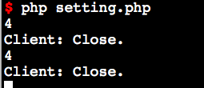

# swoole_server::$setting

swoole_server::set()函数所设置的参数会保存到swoole_server::$setting属性上。在回调函数中可以访问运行参数的值

示例：
````
$serv = new swoole_server('127.0.0.1', 9501);
$serv->set(array('worker_num' => 4));

echo $serv->setting['worker_num'];
````

## 练手demo (setting.php)


````
1.当通过浏览器访问时触发connect回调事件，可看见其输出setting内容就是在启动前set的内容
2.尝试在server未启动时执行，如示例demo一致却输出不了内容，因此认为该function是需要启动服务才能成功调用，同理也是服务启动后才能认为设置的信息生效
````

# swoole_server::$master_pid

返回当前服务器主进程的PID

# swoole_server::$manager_pid

返回当前服务器管理进程的PID。

# swoole_server::$worker_id

得到当前Worker进程的编号，包括Task进程

````
int $server->worker_id;
````

这个属性与onWorkerStart时的$worker_id是相同的。

* Worker进程编号范围是[0, $serv->setting['worker_num']-1)
* Task进程编号范围是[$serv->setting['worker_num'], $serv->setting['worker_num'] + $serv->setting['task_worker_num'])

# swoole_server::$worker_pid

得到当前Worker进程的操作系统进程ID。与posix_getpid()的返回值相同

# swoole_server::$taskworker

布尔类型

* true表示当前的进程是Task工作进程
* false表示当前的进程是Worker进程

# swoole_server::$connections

TCP连接迭代器，可以使用foreach遍历服务器当前所有的连接，此属性的功能与swoole_server->connnection_list是一致的，但是更加友好。遍历的元素为单个连接的fd。

注意$connections属性是一个迭代器对象，不是PHP数组，所以不能用var_dump或者数组下标来访问，只能通过foreach进行遍历操作。

````
foreach($server->connections as $fd)
{
    $server->send($fd, "hello");
}

echo "当前服务器共有 ".count($server->connections). " 个连接\n";
````