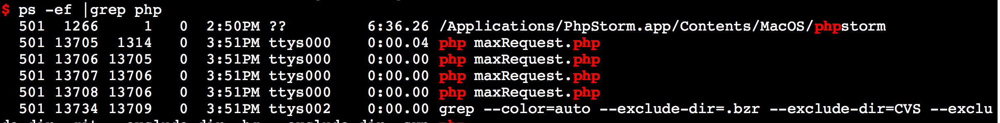
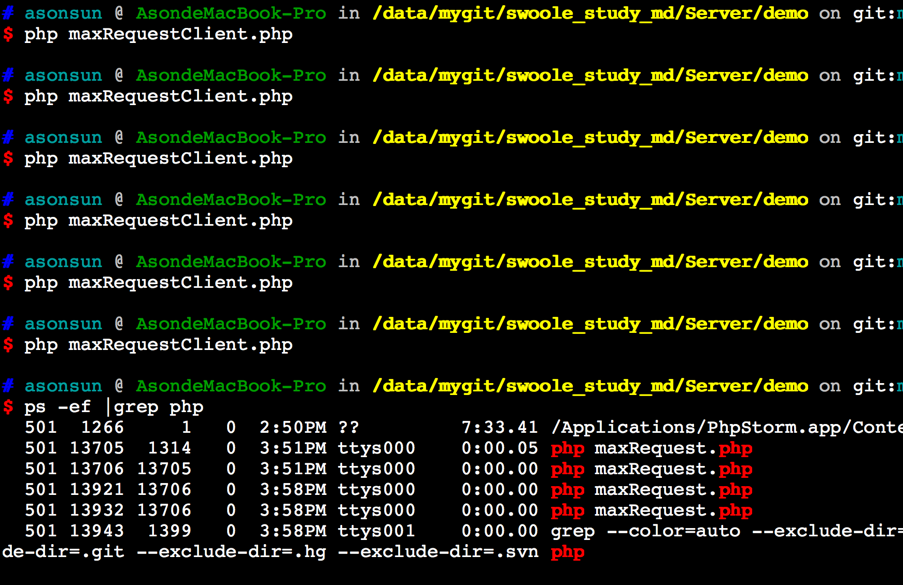

# reactor_num（核数）

Reactor线程数，reactor_num => 2，通过此参数来调节主进程内事件处理线程的数量，以充分利用多核。默认会启用CPU核数相同的数量。

reactor_num一般设置为CPU核数的1-4倍，在swoole中reactor_num最大不得超过CPU核数*4。

swoole的Reactor线程是可以利用多核，如：机器有128核，那么底层会启动128线程。每个线程能都会维持一个EventLoop。线程之间是无锁的，指令可以被128核CPU并行执行。考虑到操作系统调度存在一定程度的性能损失，可以设置为CPU核数*2，以便最大化利用CPU的每一个核。

* reactor_num必须小于或等于worker_num。如果设置的reactor_num大于worker_num，那么swoole会自动调整使reactor_num等于worker_num
* 1.7.14以上版本在超过8核的机器上reactor_num默认设置为8

# worker_num（进程数）

设置启动的worker进程数。

* 业务代码是全异步非阻塞的，这里设置为CPU的1-4倍最合理
* 业务代码为同步阻塞，需要根据请求响应时间和系统负载来调整

比如1个请求耗时100ms，要提供1000QPS的处理能力，那必须配置100个进程或更多。但开的进程越多，占用的内存就会大大增加，而且进程间切换的开销就会越来越大。所以这里适当即可。不要配置过大。

* 每个进程占用40M内存，那100个进程就需要占用4G内存

# max_request

设置worker进程的最大任务数，默认为0，一个worker进程在处理完超过此数值的任务后将自动退出，进程退出后会释放所有内存和资源。

这个参数的主要作用是解决PHP进程内存溢出问题。PHP应用程序有缓慢的内存泄漏，但无法定位到具体原因、无法解决，可以通过设置max_request解决。

* max_request只能用于同步阻塞、无状态的请求响应式服务器程序
* 在swoole中真正维持客户端TCP连接的是master进程，worker进程仅处理客户端发送来的请求，因为客户端是不需要感知Worker进程重启的
* 纯异步的Server不应当设置max_request
* 使用Base模式时max_request是无效的
* 当worker进程内发生致命错误或者人工执行exit时，进程会自动退出。master进程会重新启动一个新的worker进程来继续处理请求

## 实例代码(maxRequestServer.php,maxRequestClient.php)

创建一个swoole tcp server，我们开启两个worker进程，dispatch mode设置为3(抢占模式)，文件名保存为maxRequest.php，代码如下：

````
<?php
$serv = new swoole_server("127.0.0.1", 9501);
$serv->set(array(
    'worker_num' => 2,    //开启两个worker进程
    'max_request' => 3,   //每个worker进程max request设置为3次
    'dispatch_mode'=>3,
));
//监听数据接收事件
$serv->on('receive', function ($serv, $fd, $from_id, $data) {
    $serv->send($fd, "Server: ".$data);
});
//启动服务器
$serv->start();
````



````
1.图中pid为13705必然是master进程，而13706则为manager进程（其父进程pid为13705），进程PID为13707、13708为workder进程（其父进程为13706）
2.当执行多次客户端请求服务端的接口后再次获取进程ID，发现worker的进程ID改变了
````

# max_conn (max_connection)

服务器程序，最大允许的连接数，如max_conn => 10000, 此参数用来设置Server最大允许维持多少个tcp连接。超过此数量后，新进入的连接将被拒绝。

* max_connection最大不得超过操作系统ulimit -n的值，否则会报一条警告信息，并重置为ulimit -n的值
* max_connection默认值为ulimit -n的值

## 内存占用

max_connection参数不要调整的过大，根据机器内存的实际情况来设置。Swoole会根据此数值一次性分配一块大内存来保存Connection信息，可使用gdb跟踪运行中的进程，打印p sizeof(swConnection) 得到准确的数值。在1.9.16版本中一个TCP连接的Connection信息，需要占用224字节。

# task_worker_num

配置Task进程的数量，配置此参数后将会启用task功能。所以Server务必要注册onTask、onFinish2个事件回调函数。如果没有注册，服务器程序将无法启动。

Task进程是同步阻塞的，配置方式与Worker同步模式一致

## 计算方法

* 单个task的处理耗时，如100ms，那一个进程1秒就可以处理1/0.1=10个task
* task投递的速度，如每秒产生2000个task
* 2000/10=200，需要设置task_worker_num => 200，启用200个task进程
* Task进程内不能使用swoole_server->task方法
* Task进程内不能使用swoole_mysql、swoole_redis、swoole_event等异步IO函数

# task_ipc_mode

设置task进程与worker进程之间通信的方式
````
$serv->set(array('task_ipc_mode' => 3,))
````

* 1-使用unix socket通信，默认模式
* 2-使用消息队列通信
* 3-使用消息队列通信，并设置为争抢模式

模式2和模式3的不同之处是，模式2支持定向投递，$serv->task($data, $task_worker_id) 可以指定投递到哪个task进程。模式3是完全争抢模式，task进程会争抢队列，将无法使用定向投递，即使指定了$task_worker_id，在模式3下也是无效的。

## 消息队列模式

* 消息队列模式使用操作系统提供的内存队列存储数据，未指定 mssage_queue_key 消息队列Key，将使用私有队列，在Server程序终止后会删除消息队列。
* 指定消息队列Key后Server程序终止后，消息队列中的数据不会删除，因此进程重启后仍然能取到数据
* 可使用ipcrm -q 消息队列ID手工删除消息队列数据

# task_max_request

设置task进程的最大任务数。一个task进程在处理完超过此数值的任务后将自动退出。这个参数是为了防止PHP进程内存溢出。如果不希望进程自动退出可以设置为0

# task_tmpdir

设置task的数据临时目录，在swoole_server中，如果投递的数据超过8192字节，将启用临时文件来保存数据。这里的task_tmpdir就是用来设置临时文件保存的位置。

Swoole默认会使用/tmp目录存储task数据，如果你的Linux内核版本过低，/tmp目录不是内存文件系统，可以设置为 /dev/shm/

# dispatch_mode

数据包分发策略。可以选择3种类型，默认为2

* 1，轮循模式，收到会轮循分配给每一个worker进程
* 2，固定模式，根据连接的文件描述符分配worker。这样可以保证同一个连接发来的数据只会被同一个worker处理
* 3，抢占模式，主进程会根据Worker的忙闲状态选择投递，只会投递给处于闲置状态的Worker
* 4，IP分配，根据客户端IP进行取模hash，分配给一个固定的worker进程。可以保证同一个来源IP的连接数据总会被分配到同一个worker进程。算法为 ip2long(ClientIP) % worker_num
* 5，UID分配，需要用户代码中调用 $serv-> bind() 将一个连接绑定1个uid。然后swoole根据UID的值分配到不同的worker进程。算法为 UID % worker_num，如果需要使用字符串作为UID，可以使用crc32(UID_STRING)

## 使用建议

* 无状态Server可以使用1或3，同步阻塞Server使用3，异步非阻塞Server使用1
* 有状态使用2、4、5

## UDP协议

* dispatch_mode=2/4/5时为固定分配，底层使用客户端IP取模散列到不同的worker进程，算法为 ip2long(ClientIP) % worker_num
* dispatch_mode=1/3时随机分配到不同的worker进程

## BASE模式
dispatch_mode配置在BASE模式是无效的，因为BASE不存在投递任务，当Reactor线程收到客户端发来的数据后会立即在当前线程/进程回调onReceive，不需要投递Worker进程

# dispatch_func

设置dispatch函数，swoole底层了内置了5种dispatch_mode，如果仍然无法满足需求。可以使用编写C++函数或PHP函数，实现dispatch逻辑。使用方法

````
$serv->set(array(
    'dispatch_func' => 'my_dispatch_function',
));
````

* 设置dispatch_func后底层会自动忽略dispatch_mode配置
* dispatch_func对应的函数不存在，底层将抛出致命错误
* 如果需要dispatch一个超过8K的包，dispatch_func只能获取到 0-8180 字节的内容

## 编写PHP函数

由于ZendVM无法支持多线程环境，即使设置了多个Reactor线程，同一时间只能执行一个dispatch_func。因此底层在执行此PHP函数时会进行加锁操作，可能会存在锁的争抢问题。请勿在dispatch_func中执行任何阻塞操作，否则会导致Reactor线程组停止工作。

````
$serv->set(array(
    'dispatch_func' => function ($serv, $fd, $type, $data) {
        var_dump($fd, $type, $data);
        return intval($data[0]);
    },
));
````

* $fd为客户端连接的唯一标识符，可使用Server::getClientInfo获取连接信息
* $type数据的类型，0表示来自客户端的数据发送，4表示客户端连接关闭，5表示客户端连接建立
* $data数据内容，需要注意：如果启用了Http、EOF、Length等协议处理参数后，底层会进行包的拼接。但在dispatch_func函数中只能传入数据包的前8K内容，不能得到完整的包内容。
必须返回一个[0-serv->worker_num)的数字，表示数据包投递的目标工作进程ID
* 小于0或大于等于serv->worker_num为异常目标ID，dispatch的数据将会被丢弃

# message_queue_key

设置消息队列的KEY，仅在task_ipc_mode = 2/3时使用。设置的Key仅作为Task任务队列的KEY，此参数的默认值为ftok($php_script_file, 1)

task队列在server结束后不会销毁，重新启动程序后，task进程仍然会接着处理队列中的任务。如果不希望程序重新启动后不执行旧的Task任务。可以手工删除此消息队列。

# daemonize

守护进程化。设置daemonize => 1时，程序将转入后台作为守护进程运行。长时间运行的服务器端程序必须启用此项。

如果不启用守护进程，当ssh终端退出后，程序将被终止运行。

* 启用守护进程后，标准输入和输出会被重定向到 log_file
* 如果未设置log_file，将重定向到 /dev/null，所有打印屏幕的信息都会被丢弃
* 启用守护进程后，CWD（当前目录）环境变量的值会发生变更，相对路径的文件读写会出错。PHP程序中必须使用绝对路径

# backlog

Listen队列长度，如backlog => 128，此参数将决定最多同时有多少个等待accept的连接

## 关于tcp的backlog

我们知道tcp有三次握手的过程，客户端syn=>服务端syn+ack=>客户端ack，当服务器收到客户端的ack后会将连接放到一个叫做accept queue的队列里面（注1），队列的大小由backlog参数和配置somaxconn 的最小值决定，我们可以通过ss -lt命令查看最终的accept queue队列大小，swoole的主进程调用accept（注2）从accept queue里面取走。 当accept queue满了之后连接有可能成功（注4），也有可能失败，失败后客户端的表现就是连接被重置（注3）或者连接超时，而服务端会记录失败的记录，可以通过 netstat -s|grep 'times the listen queue of a socket overflowed'来查看日志。如果出现了上述现象，你就应该调大该值了。 幸运的是swoole与php-fpm/apache等软件不同，并不依赖backlog来解决连接排队的问题。所以基本不会遇到上述现象。

* 注1:linux2.2之后握手过程分为syn queue和accept queue两个队列, syn queue长度由tcp_max_syn_backlog决定。
* 注2:高版本内核调用的是accept4，为了节省一次set no block系统调用。
* 注3:客户端收到syn+ack包就认为连接成功了，实际上服务端还处于半连接状态，有可能发送rst包给客户端，客户端的表现就是Connection reset by peer。
* 注4:成功是通过tcp的重传机制，相关的配置有tcp_synack_retries和tcp_abort_on_overflow。

# log_file

log_file => '/data/log/swoole.log', 指定swoole错误日志文件。在swoole运行期发生的异常信息会记录到这个文件中。默认会打印到屏幕。

注意log_file不会自动切分文件，所以需要定期清理此文件。观察log_file的输出，可以得到服务器的各类异常信息和警告。

log_file中的日志仅仅是做运行时错误记录，没有长久存储的必要。

* 开启守护进程模式后(daemonize => true)，标准输出将会被重定向到log_file。在PHP代码中echo/var_dump/print等打印到屏幕的内容会写入到log_file文件

## 日志标号

在日志信息中，进程ID前会加一些标号，表示日志产生的线程/进程类型。

* \# Master进程
* $ Manager进程
* \* Worker进程
* ^ Task进程

## 重新打开日志文件

在服务器程序运行期间日志文件被mv移动或unlink删除后，日志信息将无法正常写入，这时可以向Server发送SIGRTMIN信号实现重新打开日志文件。

# log_level

设置swoole_server错误日志打印的等级，范围是0-5。低于log_level设置的日志信息不会抛出

````
$serv->set(array(
    'log_level' => 1,
));
````

## 级别对应

* 0 =>DEBUG
* 1 =>TRACE
* 2 =>INFO
* 3 =>NOTICE
* 4 =>WARNING
* 5 =>ERROR

默认是0 也就是所有级别都打印

# heartbeat_check_interval

启用心跳检测，此选项表示每隔多久轮循一次，单位为秒。如 heartbeat_check_interval => 60，表示每60秒，遍历所有连接，如果该连接在60秒内，没有向服务器发送任何数据，此连接将被强制关闭。

swoole_server并不会主动向客户端发送心跳包，而是被动等待客户端发送心跳。服务器端的heartbeat_check仅仅是检测连接上一次发送数据的时间，如果超过限制，将切断连接。

# heartbeat_idle_time

与heartbeat_check_interval配合使用。表示连接最大允许空闲的时间。如

````
array(
    'heartbeat_idle_time' => 600,
    'heartbeat_check_interval' => 60,
);
````

* 表示每60秒遍历一次，一个连接如果600秒内未向服务器发送任何数据，此连接将被强制关闭
* 启用heartbeat_idle_time后，服务器并不会主动向客户端发送数据包
* 如果只设置了heartbeat_idle_time未设置heartbeat_check_interval底层将不会创建心跳检测线程，PHP代码中可以调用heartbeat方法手工处理超时的连接

# open_eof_check

打开EOF检测，此选项将检测客户端连接发来的数据，当数据包结尾是指定的字符串时才会投递给Worker进程。否则会一直拼接数据包，直到超过缓存区或者超时才会中止。当出错时swoole底层会认为是恶意连接，丢弃数据并强制关闭连接

````
array(
'open_eof_check' => true, //打开EOF检测
'package_eof' => "\r\n", //设置EOF
)
````

常见的Memcache/SMTP/POP等协议都是以\r\n结束的，就可以使用此配置。开启后可以保证Worker进程一次性总是收到一个或者多个完整的数据包。

# open_eof_split

启用EOF自动分包。当设置open_eof_check后，底层检测数据是否以特定的字符串结尾来进行数据缓冲。但默认只截取收到数据的末尾部分做对比。这时候可能会产生多条数据合并在一个包内。

启用open_eof_split参数后，底层会从数据包中间查找EOF，并拆分数据包。onReceive每次仅收到一个以EOF字串结尾的数据包。

启用open_eof_split参数后，无论参数open_eof_check是否设置，open_eof_split都将生效。

## 与 open_eof_check 的差异

* open_eof_check 只检查接收数据的末尾是否为 EOF，因此它的性能最好，几乎没有消耗
* open_eof_check 无法解决多个数据包合并的问题，比如同时发送两条带有 EOF 的数据，底层可能会一次全部返回
* open_eof_split 会从左到右对数据进行逐字节对比，查找数据中的 EOF 进行分包，性能较差。但是每次只会返回一个数据包

# package_eof

与 open_eof_check 或者 open_eof_split 配合使用，设置EOF字符串

# open_length_check

打开包长检测特性。包长检测提供了固定包头+包体这种格式协议的解析。启用后，可以保证Worker进程onReceive每次都会收到一个完整的数据包。

长度协议提供了3个选项来控制协议细节。
